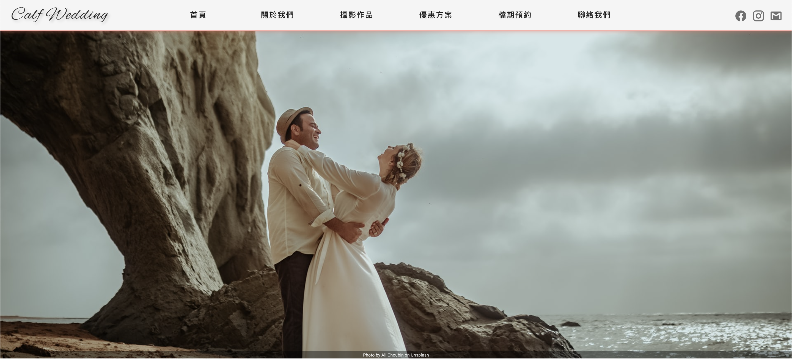
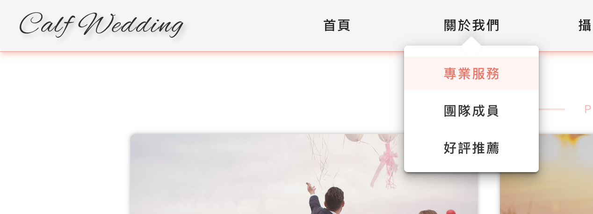
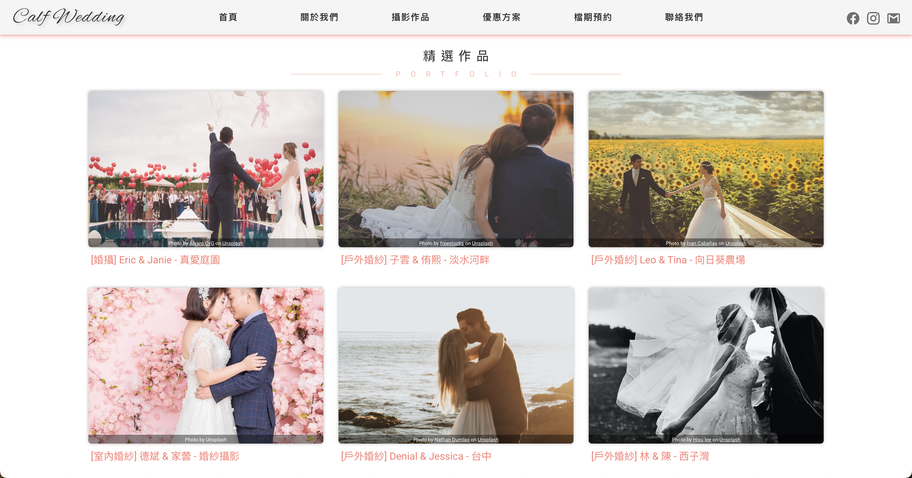
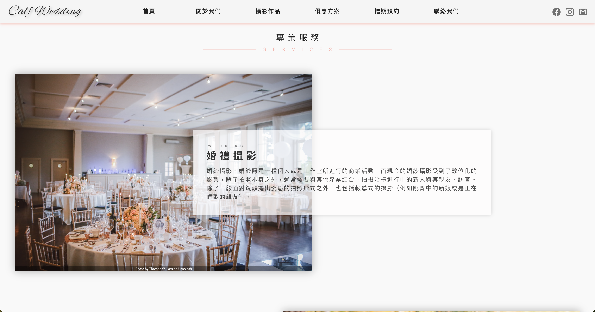
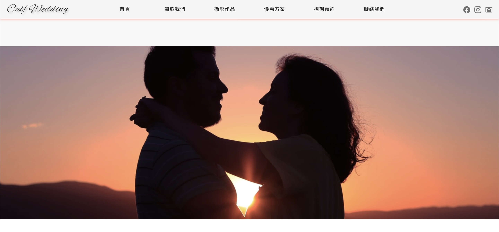
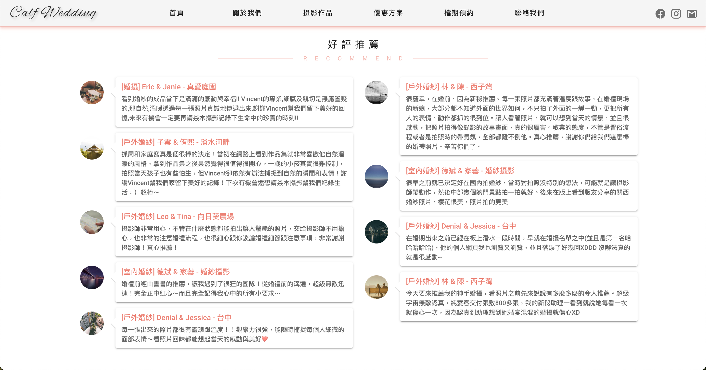
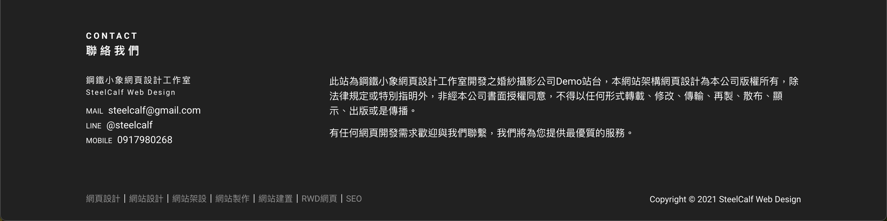

## #CalfWedding 小象婚紗攝影 Demo

#### 自我練習作品，以婚紗攝影工作室網站為主題的前端靜態網站，使用 Vue-CLI 框架建置。

[![Contributors][contributors-shield]][contributors-url]
[![Forks][forks-shield]][forks-url]
[![Stargazers][stars-shield]][stars-url]
[![Issues][issues-shield]][issues-url]
[![MIT License][license-shield]][license-url]

#### Gitgub Page: https://cookie-lee.github.io/CalfWedding/

<br/>

## 目錄

- [#專案介紹](#專案介紹)
- [#安裝步驟](#安裝步驟)
  - [##安裝](#安裝)
  - [##啟動](#啟動)
- [#專案期間](#專案期間)
- [#專案背景](#專案背景)
- [#使用技術](#使用技術)

<br/>

### #專案介紹

####

網站整體以白色為主色調，搭配清新的粉紅色調

#### ##AppBar

在首頁上方的 AppBar 中，Logo 和選單列均設計為置中


滾動後，Logo 將以動畫方式移至左側，同時 AppBar 的整體高度會縮小，以展示更多網頁資訊


選單同樣以白色搭配粉紅色，並使用偽元素來實現上方三角形區塊


#### ##精選作品

接著，精選作品區域使用框架自帶的 grid 進行三等份切割  
當滑鼠移入時，會產生相對應的互動效果


#### ##專業服務

專業服務區域將使用破格設計，讓文字與圖片有交錯堆疊的效果  
同時，使用滾動監聽和滑入動畫，使得當滑鼠往下滾動時，項目會以動畫方式逐一進入畫面


專業服務後方加入一個具有滾動視差效果的浪漫照片，用作轉場效果


#### ##好評推薦

好評推薦區域將以對話框的形式模擬使用者對服務的評價  
這裡也使用偽元素來實現左側三角形效果


#### ##聯絡我們

最後的頁尾是聯絡我們區域，使用與主色相反的黑底白字來呈現


####

點擊至網頁以體驗最佳效果  
Gitgub Page: https://cookie-lee.github.io/CalfWedding/

<br/>

### #安裝步驟

```sh
git clone https://github.com/Cookie-Lee/CalfWedding.git
```

###### 在電腦上需要全域安裝 'node' 和 'npm'

#### ##安裝:

`npm install`

#### ##啟動:

`npm run serve`

###### 啟動後會執行本機站台: [http://localhost:3000](http://localhost:3000)

<br/>

### #專案期間

2021-07-11 ~ 2021-7-23

<br/>

### #專案背景

####

這是一個自我練習的作品，主要想練習自己設計畫面並撰寫 CSS 來達成效果，故此專案僅有前端畫面。  
訂定好練習目標後，即決定題目，並開始為期一週左右的資料查找  
除了參考 [Awwwards](https://www.awwwards.com/) 大神作品外，也以台灣多個攝影工作室官網作為參考  
遇到最麻煩的問題，也是我想練習的目標，就是畫面的設計，因為沒有設計師的協助，故所有畫面都是靠自己的認知及想像來完成

<br/>

### #使用技術

- Vue
- Vue-Router
- Vuex
- pug
- sass
- Vuetify

<!-- links -->

[your-project-path]: Cookie-Lee/CalfWedding
[contributors-shield]: https://img.shields.io/github/contributors/Cookie-Lee/CalfWedding.svg?style=flat-square
[contributors-url]: https://github.com/Cookie-Lee/CalfWedding/graphs/contributors
[forks-shield]: https://img.shields.io/github/forks/Cookie-Lee/CalfWedding.svg?style=flat-square
[forks-url]: https://github.com/Cookie-Lee/CalfWedding/network/members
[stars-shield]: https://img.shields.io/github/stars/Cookie-Lee/CalfWedding.svg?style=flat-square
[stars-url]: https://github.com/Cookie-Lee/CalfWedding/stargazers
[issues-shield]: https://img.shields.io/github/issues/Cookie-Lee/CalfWedding.svg?style=flat-square
[issues-url]: https://img.shields.io/github/issues/Cookie-Lee/CalfWedding.svg
[license-shield]: https://img.shields.io/github/license/Cookie-Lee/CalfWedding.svg?style=flat-square
[license-url]: https://github.com/Cookie-Lee/CalfWedding/blob/master/LICENSE.txt
